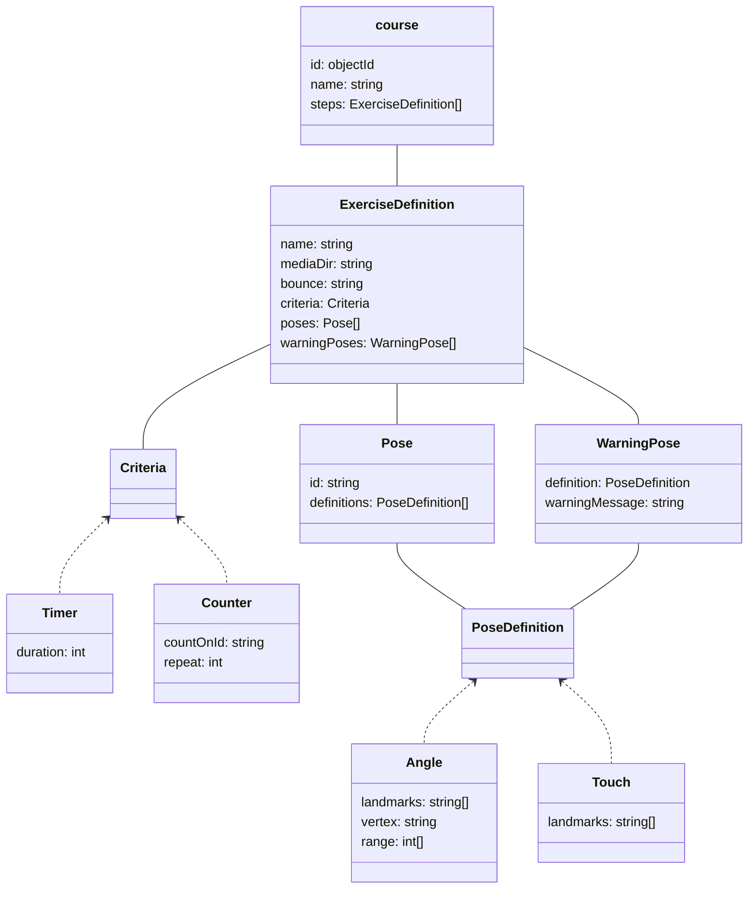

```mermaid
%%{init: {
    "fontFamily": "Helvetica"
}
}%%

classDiagram
    class course{
        id: objectId
        name: string
        steps: ExerciseDefinition[]
    }

    course -- ExerciseDefinition

    class ExerciseDefinition{
        name: string
        mediaDir: string
        bounce: string
        criteria: Criteria
        poses: Pose[]
        warningPoses: WarningPose[]
    }
    ExerciseDefinition -- Criteria

    class Criteria{
        
    }
    
    class Timer{
        duration: int
    }
    class Counter{
        countOnId: string
        repeat: int
    }
    
    Criteria <.. Timer
    Criteria <.. Counter
    
    
    class Pose{
        id: string
        definitions: PoseDefinition[]
    }
    
    class PoseDefinition{
    
    }
    
    class Angle{
        landmarks: string[]
        vertex: string
        range: int[]
    }
    
    class Touch{
        landmarks: string[]
    }
    
    ExerciseDefinition -- Pose
    Pose -- PoseDefinition
    
    PoseDefinition <..  Angle
    PoseDefinition <.. Touch
    
    class WarningPose{
        definition: PoseDefinition
        warningMessage: string
    }
    
    ExerciseDefinition -- WarningPose
    WarningPose -- PoseDefinition
```

