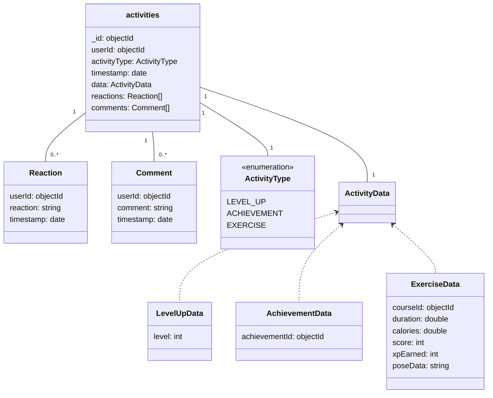

```mermaid
%%{init: {
    "fontFamily": "Helvetica"
}
}%%
classDiagram
    activities "1" -- "0..*" Reaction
    activities "1" -- "0..*" Comment
    activities "1" -- "1" ActivityType
    activities "1" -- "1" ActivityData

    class activities{
        _id: objectId
        userId: objectId
        activityType: ActivityType
        timestamp: date
        data: ActivityData
        reactions: Reaction[]
        comments: Comment[]
    }

    class ActivityData{

    }

    ActivityData <.. LevelUpData
    ActivityData <.. AchievementData
    ActivityData <.. ExerciseData

    class LevelUpData{
        level: int
    }

    class AchievementData{
        achievementId: objectId
    }

    class ExerciseData{
        courseId: objectId
        duration: double
        calories: double
        score: int
        xpEarned: int
        poseData: string
    }

    class ActivityType{
        <<enumeration>>
        LEVEL_UP
        ACHIEVEMENT
        EXERCISE
    }

    class Reaction{
        userId: objectId
        reaction: string
        timestamp: date
    }

    class Comment{
        userId: objectId
        comment: string
        timestamp: date
    }

 
```