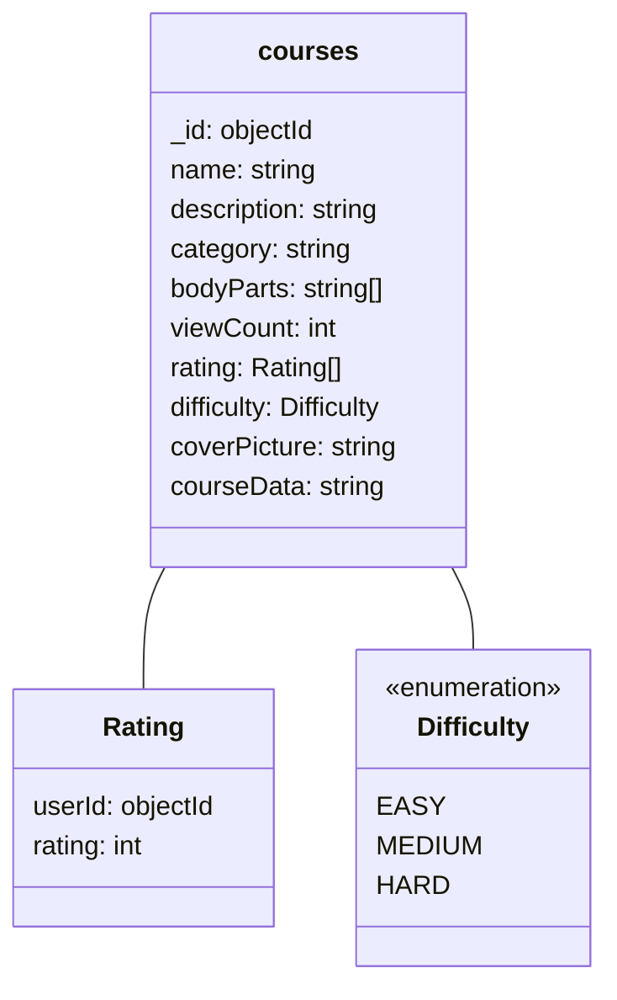

```mermaid
%%{init: {
    "fontFamily": "Helvetica"
}
}%%
classDiagram
    courses -- Rating
    courses -- Difficulty

    class courses{
        _id: objectId
        name: string
        description: string
        category: string
        bodyParts: string[]
        viewCount: int
        rating: Rating[]
        difficulty: Difficulty
        coverPicture: string
        courseData: string
    }

    class Rating{
        userId: objectId
        rating: int
    }

    class Difficulty{
        <<enumeration>>
        EASY
        MEDIUM
        HARD
    }

 
```