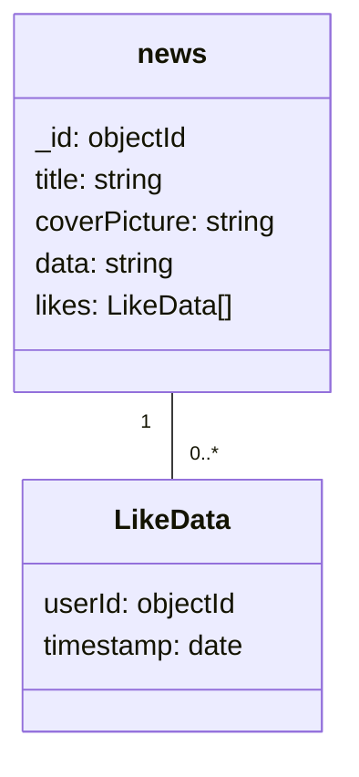

```mermaid
%%{init: {
    "fontFamily": "Helvetica"
}
}%%
classDiagram
    news "1" -- "0..*" LikeData
    class news{
        _id: objectId
        title: string
        coverPicture: string
        data: string
        likes: LikeData[]
    }

    class LikeData{
        userId: objectId
        timestamp: date
    }

```