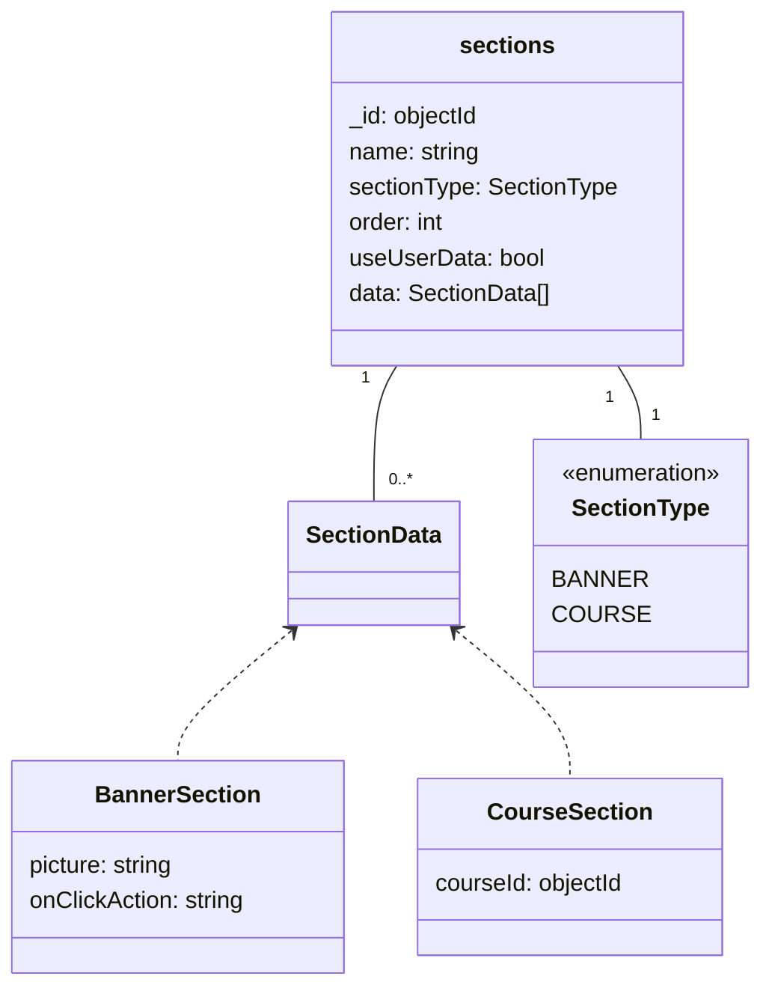

```mermaid
%%{init: {
    "fontFamily": "Helvetica"
}
}%%
classDiagram
    sections "1" -- "0..*" SectionData
    sections "1" -- "1" SectionType

    class sections{
        _id: objectId
        name: string
        sectionType: SectionType
        order: int
        useUserData: bool
        data: SectionData[]
    }

    SectionData <.. BannerSection
    SectionData <.. CourseSection
    class SectionData{

    }
    class BannerSection{
        picture: string
        onClickAction: string
    }
    class CourseSection{
        courseId: objectId
    }

    class SectionType{
        <<enumeration>>
        BANNER
        COURSE
    }

 
```