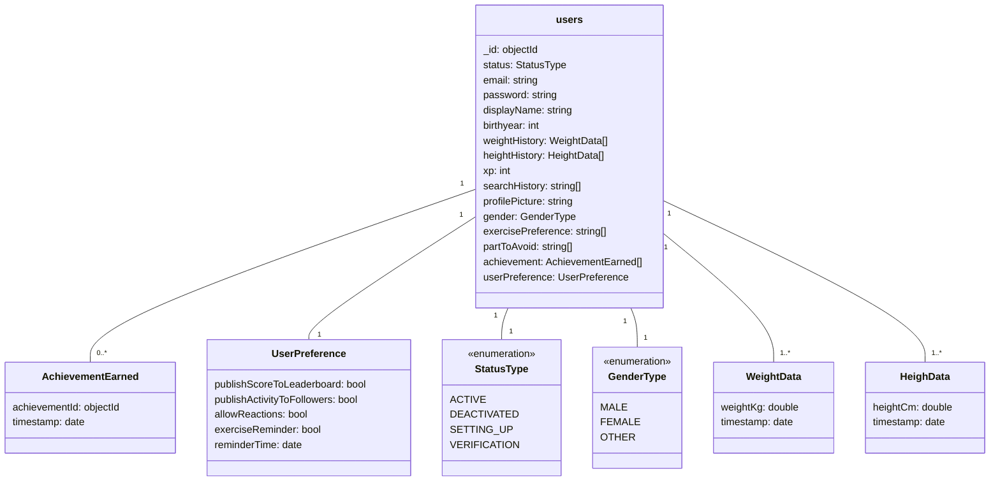

```mermaid
%%{init: {
    "fontFamily": "Helvetica"
}
}%%
classDiagram
    users "1" -- "0..*" AchievementEarned
    users "1" -- "1" UserPreference
    users "1" -- "1" StatusType
    users "1" -- "1" GenderType
    users "1" -- "1..*" WeightData
    users "1" -- "1..*" HeighData

    class users{
        _id: objectId
        status: StatusType
        email: string
        password: string
        displayName: string
        birthyear: int
        weightHistory: WeightData[]
        heightHistory: HeightData[]
        xp: int
        searchHistory: string[]
        profilePicture: string
        gender: GenderType
        exercisePreference: string[]
        partToAvoid: string[]
        achievement: AchievementEarned[]
        userPreference: UserPreference
    }

    class AchievementEarned{
        achievementId: objectId
        timestamp: date
    }

    class UserPreference{
        publishScoreToLeaderboard: bool
        publishActivityToFollowers: bool
        allowReactions: bool
        exerciseReminder: bool
        reminderTime: date
    }

    class StatusType{
        <<enumeration>>
        ACTIVE
        DEACTIVATED
        SETTING_UP
        VERIFICATION
    }

    class GenderType{
        <<enumeration>>
        MALE
        FEMALE
        OTHER
    }

    class WeightData{
        weightKg: double
        timestamp: date
    }

    class HeighData{
        heightCm: double
        timestamp: date
    }
 
```