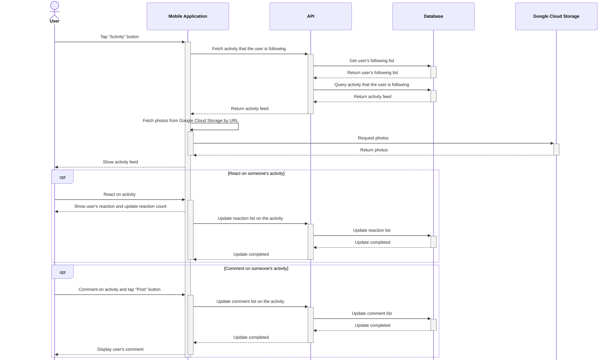

```mermaid
%%{init: {
    "fontFamily": "Helvetica",
    "style": "height: auto",
    "sequence": {
            "mirrorActors": false,

            "actorFontFamily": "Helvetica",
            "actorFontSize": 24,
            "actorFontWeight": "bold",
            "actorMargin": 150,

            "messageFontFamily": "Helvetica",
            "messageFontWeight": 200,
            "messageFontSize": 24,
            
            "activationWidth": 20,
            
            "width": 300,
            "height": 100,

            "rightAngles": true,

            "labelBoxWidth": 80,
            "labelBoxHeight": 50,
            "wrapPadding": 0,
            
            "useMaxWidth": false
        }
    }
}%%
sequenceDiagram
    actor User
    participant App as Mobile Application
    participant API
    participant DB as Database
    participant GCS as Google Cloud Storage

    User->>+App: Tap "Activity" button
    App->>+API: Fetch activity that the user is following
    API->>+DB: Get user's following list
    DB-->>-API: Return user's following list
    API->>+DB: Query activity that the user is following
    DB-->>-API: Return activity feed
    
    API-->>-App: Return activity feed
    App->>+App: Fetch photos from Google Cloud Storage by URL
    App->>+GCS: Request photos
    GCS-->>-App: Return photos
    deactivate App

    App-->>User: Show activity feed

    opt React on someone's activity
        User->>+App: React on activity
        App-->>User: Show user's reaction and update reaction count
        App->>+API: Update reaction list on the activity
        API->>+DB: Update reaction list
        DB-->>-API: Update completed
        API-->>-App: Update completed
        deactivate App
    end

    opt Comment on someone's activity
        User->>+App: Comment on activity and tap "Post" button
        App->>+API: Update comment list on the activity
        API->>+DB: Update comment list
        DB-->>-API: Update completed
        API-->>-App: Update completed
        App-->>User: Display user's comment
        deactivate App
    end

    deactivate App
    

```