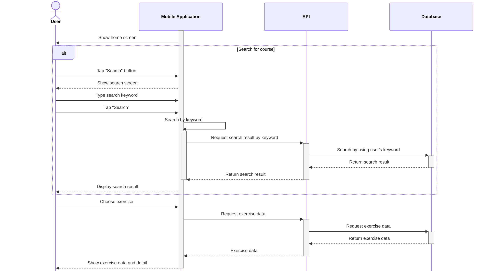

```mermaid
%%{init: {
    "fontFamily": "Helvetica",
    "style": "height: auto",
    "sequence": {
            "mirrorActors": false,

            "actorFontFamily": "Helvetica",
            "actorFontSize": 24,
            "actorFontWeight": "bold",
            "actorMargin": 150,

            "messageFontFamily": "Helvetica",
            "messageFontWeight": 200,
            "messageFontSize": 24,
            
            "activationWidth": 20,
            
            "width": 300,
            "height": 100,

            "rightAngles": true,

            "labelBoxWidth": 80,
            "labelBoxHeight": 50,
            "wrapPadding": 0,
            
            "useMaxWidth": false
        }
    }
}%%
sequenceDiagram
    actor User
    participant App as Mobile Application
    participant API
    participant DB as Database

    activate App

    App->>User: Show home screen
    
    alt Search for course
        User->>App: Tap "Search" button
        App-->>User: Show search screen
        User->>App: Type search keyword
        User->>App: Tap "Search"
        App->>+App: Search by keyword
        App->>+API: Request search result by keyword
        API->>+DB: Search by using user's keyword
        DB-->>-API: Return search result
        API-->>-App: Return search result
        deactivate App
        App-->>User: Display search result
    end
    User->>App: Choose exercise
    App->>+API: Request exercise data
    API->>+DB: Request exercise data
    DB-->>-API: Return exercise data
    API-->>-App: Exercise data
    App-->>User: Show exercise data and detail
    deactivate App


```
