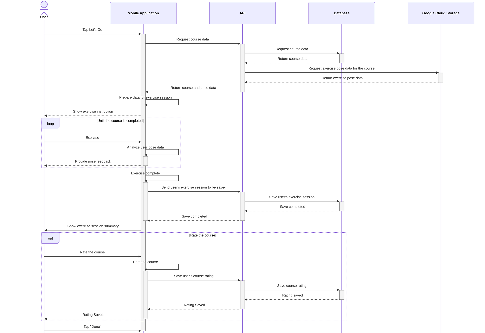

```mermaid
%%{init: {
    "fontFamily": "Helvetica",
    "style": "height: auto",
    "sequence": {
            "mirrorActors": false,

            "actorFontFamily": "Helvetica",
            "actorFontSize": 24,
            "actorFontWeight": "bold",
            "actorMargin": 150,

            "messageFontFamily": "Helvetica",
            "messageFontWeight": 200,
            "messageFontSize": 24,
            
            "activationWidth": 20,
            
            "width": 300,
            "height": 100,

            "rightAngles": true,

            "labelBoxWidth": 80,
            "labelBoxHeight": 50,
            "wrapPadding": 0,
            
            "useMaxWidth": false
        }
    }
}%%
sequenceDiagram
    actor User
    participant App as Mobile Application
    participant API
    participant DB as Database
    participant GCS as Google Cloud Storage
    

    User->>+App: Tap Let's Go

    App->>+API: Request course data
    API->>+DB: Request course data
    DB-->>-API: Return course data
    API->>+GCS: Request exercise pose data for the course
    GCS-->>-API: Return exercise pose data
    API-->>-App: Return course and pose data

    App->>App: Prepare data for exercise session
    App-->>User: Show exercise instruction
    loop Until the course is completed
        User->>App: Exercise
        App->>+App: Analyze user pose data
        App-->>-User: Provide pose feedback
    end
    App->>+App: Exercise complete
    App->>+API: Send user's exercise session to be saved
    API->>+DB: Save user's exercise session
    DB-->>-API: Save completed
    API-->>-App: Save completed

    deactivate App

    App->>User: Show exercise session summary
    opt Rate the course
        User->>App: Rate the course
        App->>+App: Rate the course
        App->>+API: Save user's course rating
        API->>+DB: Save course rating
        DB-->>-API: Rating saved
        API-->>-App: Rating Saved
        App-->>-User: Rating Saved
    end

    User->>App: Tap "Done"
    deactivate App

```
