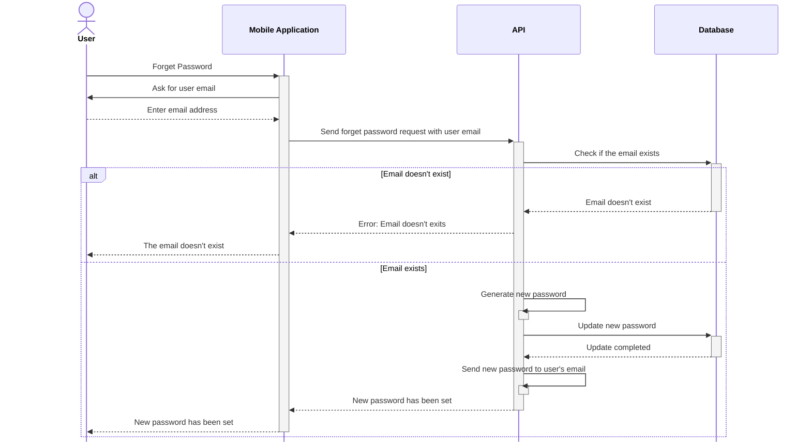

```mermaid
%%{init: {
    "fontFamily": "Helvetica",
    "sequence": {
            "mirrorActors": false,

            "actorFontFamily": "Helvetica",
            "actorFontSize": 18,
            "actorFontWeight": "bold",
            "actorMargin": 150,

            "messageFontFamily": "Helvetica",
            "messageFontWeight": 200,
            "messageFontSize": 14,
            
            "activationWidth": 20,
            
            "width": 250,
            "height": 100,

            "rightAngles": true,

            "labelBoxWidth": 50,
            "labelBoxHeight": 30,
            "wrapPadding": 0
        }
    }
}%%
sequenceDiagram
    actor User
    participant App as Mobile Application
    participant API
    participant DB as Database

    User->>+App: Forget Password
    App->>User: Ask for user email
    User-->>App: Enter email address
    App->>+API: Send forget password request with user email
    API->>+DB: Check if the email exists
    
    alt Email doesn't exist
    DB-->>-API: Email doesn't exist
    API-->>App: Error: Email doesn't exits
    App-->>User: The email doesn't exist
    else Email exists

    
    API->>+API: Generate new password
    deactivate API

    API->>+DB: Update new password
    DB-->>-API: Update completed

    
    API->>+API: Send new password to user's email
    deactivate API
    API-->>-App: New password has been set
    App-->>-User: New password has been set

    end
    
```