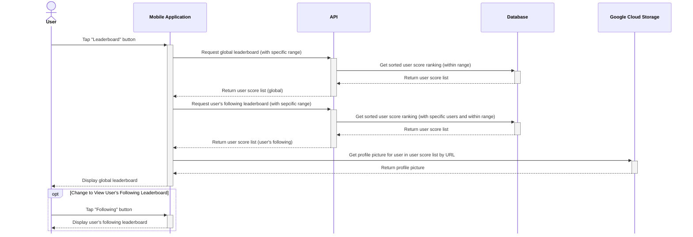

```mermaid
%%{init: {
    "fontFamily": "Helvetica",
    "sequence": {
            "mirrorActors": false,

            "actorFontFamily": "Helvetica",
            "actorFontSize": 18,
            "actorFontWeight": "bold",
            "actorMargin": 150,

            "messageFontFamily": "Helvetica",
            "messageFontWeight": 200,
            "messageFontSize": 14,
            
            "activationWidth": 20,
            
            "width": 250,
            "height": 100,

            "rightAngles": true,

            "labelBoxWidth": 50,
            "labelBoxHeight": 30,
            "wrapPadding": 0
        }
    }
}%%
sequenceDiagram
    actor User
    participant App as Mobile Application
    participant API
    participant DB as Database
    participant GCS as Google Cloud Storage

    User->>+App: Tap "Leaderboard" button
    App->>+API: Request global leaderboard (with specific range)
    API->>+DB: Get sorted user score ranking (within range)
    DB-->>-API: Return user score list
    API-->>-App: Return user score list (global)

    App->>+API: Request user's following leaderboard (with sepcific range)
    API->>+DB: Get sorted user score ranking (with specific users and within range)
    DB-->>-API: Return user score list
    API-->>-App: Return user score list (user's following)

    App->>+GCS: Get profile picture for user in user score list by URL
    GCS-->>-App: Return profile picture

    App-->>-User: Display global leaderboard

    opt Change to View User's Following Leaderboard
        User->>+App: Tap "Following" button
        App-->>-User: Display user's following leaderboard
    end

```