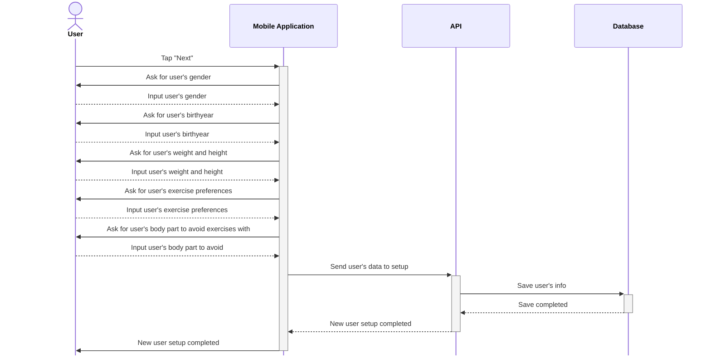

```mermaid
%%{init: {
    "fontFamily": "Helvetica",
    "sequence": {
            "mirrorActors": false,

            "actorFontFamily": "Helvetica",
            "actorFontSize": 18,
            "actorFontWeight": "bold",
            "actorMargin": 150,

            "messageFontFamily": "Helvetica",
            "messageFontWeight": 200,
            "messageFontSize": 14,
            
            "activationWidth": 20,
            
            "width": 250,
            "height": 100,

            "rightAngles": true,

            "labelBoxWidth": 50,
            "labelBoxHeight": 30,
            "wrapPadding": 0
        }
    }
}%%
sequenceDiagram
    actor User
    participant App as Mobile Application
    participant API
    participant DB as Database

    User->>+App: Tap "Next"
    App->>User: Ask for user's gender
    User-->>App: Input user's gender
    App->>User: Ask for user's birthyear
    User-->>App: Input user's birthyear
    App->>User: Ask for user's weight and height
    User-->>App: Input user's weight and height
    App->>User: Ask for user's exercise preferences
    User-->>App: Input user's exercise preferences
    App->>User: Ask for user's body part to avoid exercises with
    User-->>App: Input user's body part to avoid
    App->>+API: Send user's data to setup
    API->>+DB: Save user's info
    DB-->>-API: Save completed
    API-->>-App: New user setup completed
    App->>-User: New user setup completed
```