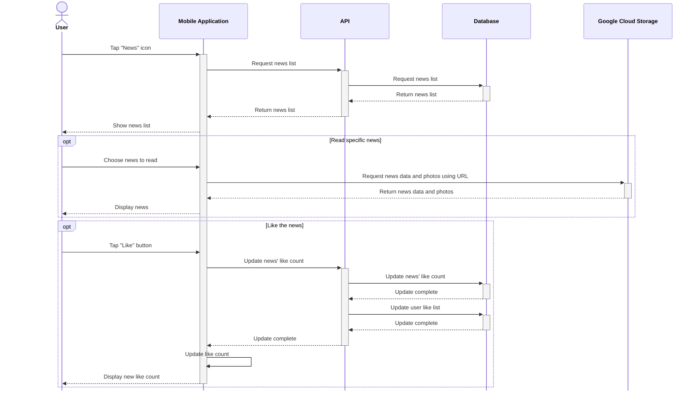

```mermaid
%%{init: {
    "fontFamily": "Helvetica",
    "sequence": {
            "mirrorActors": false,

            "actorFontFamily": "Helvetica",
            "actorFontSize": 18,
            "actorFontWeight": "bold",
            "actorMargin": 150,

            "messageFontFamily": "Helvetica",
            "messageFontWeight": 200,
            "messageFontSize": 14,
            
            "activationWidth": 20,
            
            "width": 250,
            "height": 100,

            "rightAngles": true,

            "labelBoxWidth": 50,
            "labelBoxHeight": 30,
            "wrapPadding": 0
        }
    }
}%%
sequenceDiagram
    actor User
    participant App as Mobile Application
    participant API
    participant DB as Database
    participant GCS as Google Cloud Storage

    User->>+App: Tap "News" icon
    App->>+API: Request news list
    API->>+DB: Request news list
    DB-->>-API: Return news list
    API-->>-App: Return news list
    App-->>User: Show news list

    opt Read specific news
        User->>App: Choose news to read
        App->>+GCS: Request news data and photos using URL
        GCS-->>-App: Return news data and photos
        App-->>User: Display news
    end

    opt Like the news
        User->>App: Tap "Like" button
        App->>+API: Update news' like count
        API->>+DB: Update news' like count
        DB-->>-API: Update complete
        API->>+DB: Update user like list
        DB-->>-API: Update complete
        API-->>-App: Update complete
        App->>App: Update like count
        App-->>-User: Display new like count
    end


    


```