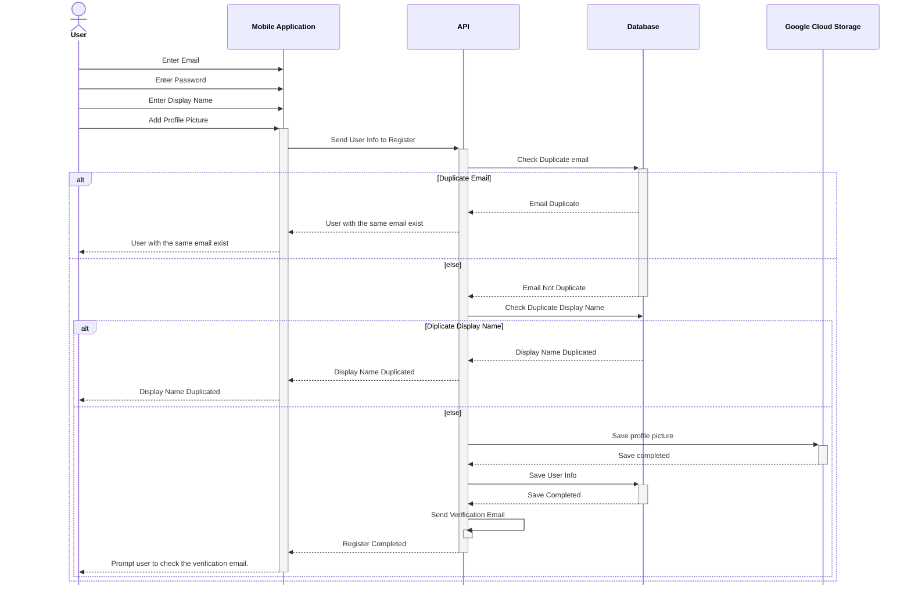

```mermaid
%%{init: {
    "fontFamily": "Helvetica",
    "sequence": {
            "mirrorActors": false,

            "actorFontFamily": "Helvetica",
            "actorFontSize": 18,
            "actorFontWeight": "bold",
            "actorMargin": 150,

            "messageFontFamily": "Helvetica",
            "messageFontWeight": 200,
            "messageFontSize": 14,
            
            "activationWidth": 20,
            
            "width": 250,
            "height": 100,

            "rightAngles": true,

            "labelBoxWidth": 50,
            "labelBoxHeight": 30,
            "wrapPadding": 0
        }
    }
}%%
sequenceDiagram
    actor User
    participant App as Mobile Application
    participant API
    participant DB as Database
    participant GCS as Google Cloud Storage

    User->>App: Enter Email
    User->>App: Enter Password
    User->>App: Enter Display Name
    User->>+App: Add Profile Picture
    
    App->>+API: Send User Info to Register
    

    API->>+DB: Check Duplicate email

    alt Duplicate Email

    DB-->>API: Email Duplicate
    API-->>App: User with the same email exist
    App-->>User: User with the same email exist

    else else

    DB-->>-API: Email Not Duplicate
    
    API->>DB: Check Duplicate Display Name

    alt Diplicate Display Name
    DB-->>API: Display Name Duplicated
    API-->>App: Display Name Duplicated
    App-->>User: Display Name Duplicated
    
    else else
    API->>+GCS: Save profile picture
    GCS-->>-API: Save completed

    API->>+DB: Save User Info
    DB-->>-API: Save Completed

    API->>+API: Send Verification Email
    deactivate API
    
    API-->>-App: Register Completed
    App-->>-User: Prompt user to check the verification email.
    end
    end
    
```