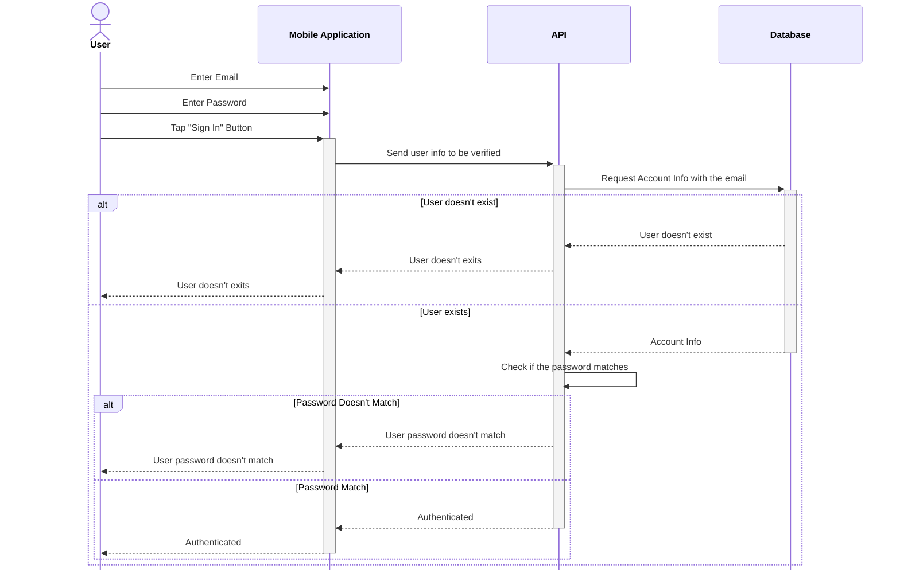

```mermaid
%%{init: {
    "fontFamily": "Helvetica",
    "sequence": {
            "mirrorActors": false,

            "actorFontFamily": "Helvetica",
            "actorFontSize": 18,
            "actorFontWeight": "bold",
            "actorMargin": 150,

            "messageFontFamily": "Helvetica",
            "messageFontWeight": 200,
            "messageFontSize": 14,
            
            "activationWidth": 20,
            
            "width": 250,
            "height": 100,

            "rightAngles": true,

            "labelBoxWidth": 50,
            "labelBoxHeight": 30,
            "wrapPadding": 0
        }
    }
}%%
sequenceDiagram
    actor User
    participant App as Mobile Application
    participant API
    participant DB as Database

    User->>App: Enter Email
    User->>App: Enter Password
    User->>+App: Tap "Sign In" Button

    App->>+API: Send user info to be verified

    API->>+DB: Request Account Info with the email

    alt User doesn't exist
    DB-->>API: User doesn't exist
    API-->>App: User doesn't exits
    App-->>User: User doesn't exits

    else User exists
    DB-->>-API: Account Info
    API->>API: Check if the password matches
        alt Password Doesn't Match
            API-->>App: User password doesn't match
            App-->>User: User password doesn't match
            else Password Match
            API-->>-App: Authenticated
            App-->>-User: Authenticated
        end
    end
```