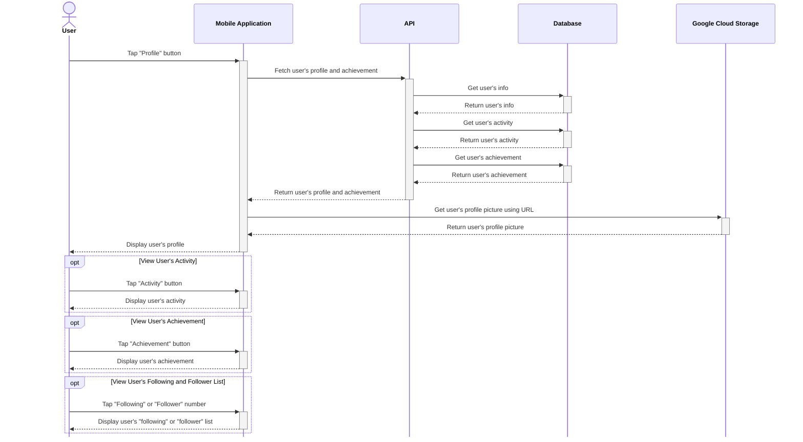

```mermaid
%%{init: {
    "fontFamily": "Helvetica",
    "sequence": {
            "mirrorActors": false,

            "actorFontFamily": "Helvetica",
            "actorFontSize": 18,
            "actorFontWeight": "bold",
            "actorMargin": 150,

            "messageFontFamily": "Helvetica",
            "messageFontWeight": 200,
            "messageFontSize": 14,
            
            "activationWidth": 20,
            
            "width": 250,
            "height": 100,

            "rightAngles": true,

            "labelBoxWidth": 50,
            "labelBoxHeight": 30,
            "wrapPadding": 0
        }
    }
}%%
sequenceDiagram
    actor User
    participant App as Mobile Application
    participant API
    participant DB as Database
    participant GCS as Google Cloud Storage

    User->>+App: Tap "Profile" button
    App->>+API: Fetch user's profile and achievement 
    API->>+DB: Get user's info
    DB-->>-API: Return user's info
    API->>+DB: Get user's activity
    DB-->>-API: Return user's activity
    API->>+DB: Get user's achievement
    DB-->>-API: Return user's achievement
    API-->>-App: Return user's profile and achievement
    App->>+GCS: Get user's profile picture using URL
    GCS-->>-App: Return user's profile picture
    App-->>-User: Display user's profile

    opt View User's Activity
        User->>+App: Tap "Activity" button
        App-->>-User: Display user's activity
    end

    opt View User's Achievement
        User->>+App: Tap "Achievement" button
        App-->>-User: Display user's achievement
    end

    opt View User's Following and Follower List
        User->>+App: Tap "Following" or "Follower" number
        App-->>-User: Display user's "following" or "follower" list
    end


```