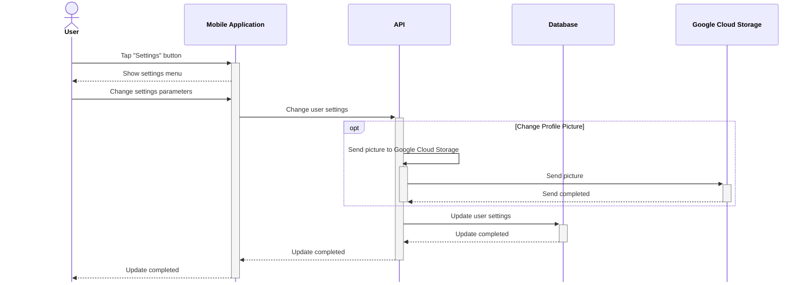

```mermaid
%%{init: {
    "fontFamily": "Helvetica",
    "sequence": {
            "mirrorActors": false,

            "actorFontFamily": "Helvetica",
            "actorFontSize": 18,
            "actorFontWeight": "bold",
            "actorMargin": 150,

            "messageFontFamily": "Helvetica",
            "messageFontWeight": 200,
            "messageFontSize": 14,
            
            "activationWidth": 20,
            
            "width": 250,
            "height": 100,

            "rightAngles": true,

            "labelBoxWidth": 50,
            "labelBoxHeight": 30,
            "wrapPadding": 0
        }
    }
}%%
sequenceDiagram
    actor User
    participant App as Mobile Application
    participant API
    participant DB as Database
    participant GCS as Google Cloud Storage

    User->>+App: Tap "Settings" button
    App-->>User: Show settings menu
    User->>App: Change settings parameters
    App->>+API: Change user settings

    opt Change Profile Picture
        API->>+API: Send picture to Google Cloud Storage
        API->>+GCS: Send picture
        GCS-->>-API: Send completed
        deactivate API
    end

    API->>+DB: Update user settings
    DB-->>-API: Update completed
    API-->>-App: Update completed
    App-->>-User: Update completed

```