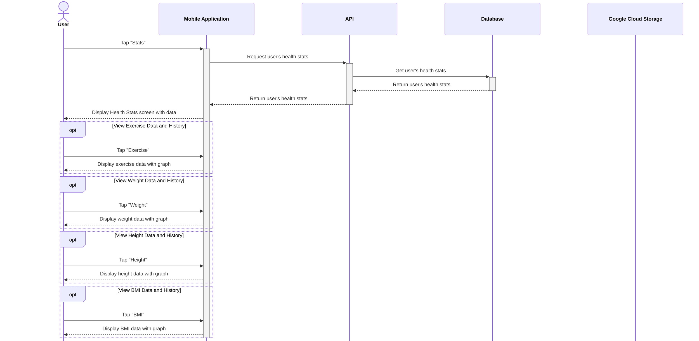

```mermaid
%%{init: {
    "fontFamily": "Helvetica",
    "style": "height: auto",
    "sequence": {
            "mirrorActors": false,

            "actorFontFamily": "Helvetica",
            "actorFontSize": 24,
            "actorFontWeight": "bold",
            "actorMargin": 150,

            "messageFontFamily": "Helvetica",
            "messageFontWeight": 200,
            "messageFontSize": 24,
            
            "activationWidth": 20,
            
            "width": 300,
            "height": 100,

            "rightAngles": true,

            "labelBoxWidth": 80,
            "labelBoxHeight": 50,
            "wrapPadding": 0,
            
            "useMaxWidth": false
        }
    }
}%%
sequenceDiagram
    actor User
    participant App as Mobile Application
    participant API
    participant DB as Database
    participant GCS as Google Cloud Storage

    User->>+App: Tap "Stats"
    App->>+API: Request user's health stats
    API->>+DB: Get user's health stats
    DB-->>-API: Return user's health stats
    API-->>-App: Return user's health stats
    App-->>User: Display Health Stats screen with data

    opt View Exercise Data and History
        User->>App: Tap "Exercise"
        App-->>User: Display exercise data with graph
    end

    opt View Weight Data and History
        User->>App: Tap "Weight"
        App-->>User: Display weight data with graph
    end

    opt View Height Data and History
        User->>App: Tap "Height"
        App-->>User: Display height data with graph
    end

    opt View BMI Data and History
        User->>App: Tap "BMI"
        App-->>User: Display BMI data with graph
    end

    deactivate App
    
```